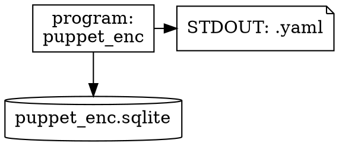

# puppet_enc
There are a lot of good practices out there for Node Classifying in Puppet. These methods all are based on scripts in any language. I was learning to program in Rust and the thought came to my mind to develop a program, that makes use of a database (at first sqlite3, but why not extending to puppetdb?) and output to stdout the required yaml (explanation on Puppet ENC: [https://www.puppet.com/docs/puppet/8/nodes_external.html](https://www.puppet.com/docs/puppet/8/nodes_external.html)). 

# Program outline
Using graphviz-dot:


# SQL
see: [README.md](db/README.md)

# RUN
```bash
cargo test
cargo build
cargo run
cargo release version patch --execute --no-confirm
cargo release commit --execute --no-confirm
cargo release tag --execute --no-confirm
cargo release push --execute --no-confirm
cargo rpm build -v
find target/release/rpmbuild/RPMS/ -type f -name *.rpm
```

## License

Licensed under the Apache License, Version 2.0 (the "License");
you may not use this file except in compliance with the License.
You may obtain a copy of the License at

    https://www.apache.org/licenses/LICENSE-2.0

Unless required by applicable law or agreed to in writing, software
distributed under the License is distributed on an "AS IS" BASIS,
WITHOUT WARRANTIES OR CONDITIONS OF ANY KIND, either express or implied.
See the License for the specific language governing permissions and
limitations under the License.
